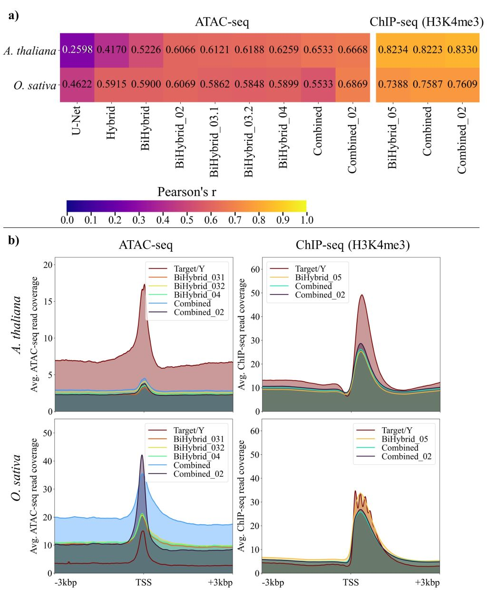
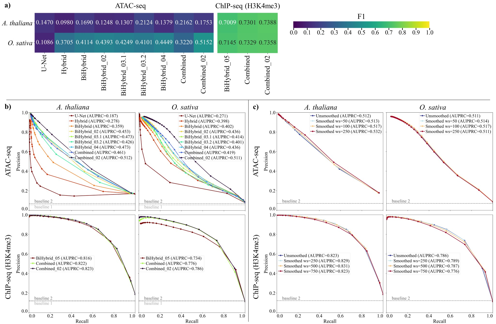
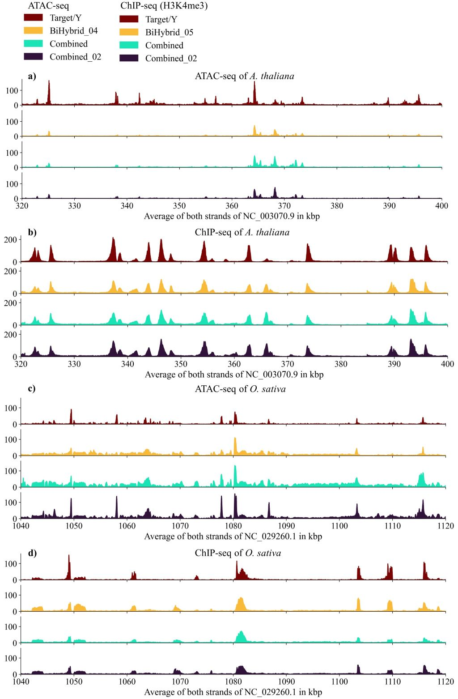

# Predmoter models
The listed models are trained Predmoter (https://github.com/weberlab-hhu/Predmoter)
models. Out of three replicates, meaning three training runs with different seeds,
these models had the highest validation "accuracy", meaning Pearson's correlation. The
models were trained on plant ATAC- and/or ChIP-seq (H3K4me3) data.

>IMPORTANT: Models trained on a GPU can be used to generate predictions on the CPU.
> The CPU predictions will be the same as the GPU predictions would be. Predicting
> on the CPU will take a little longer.
     
The best model for predicting ATAC- and H3K4me3 ChIP-seq seq data is the Combined_02
model.
     
## Table of contents
1. [Model information](#1-model-information)
2. [Model performance](#2-model-performance)
3. [Predict with Predmoter](#3-predict-with-predmoter)
4. [Additional information](#4-additional-information)
5. [References](#references)
6. [Citation](#citation)
     
## 1. Model information
A model can only predict the dataset(s) it was trained on. The model architecture is
listed for completeness.    

| Model name    | Dataset(s)                                                                                                                                             | Architecture                                                                                          |
|:--------------|:-------------------------------------------------------------------------------------------------------------------------------------------------------|:------------------------------------------------------------------------------------------------------|
| U-Net         | 	ATAC-seq                                                                                                                                              | 3 convolutional layers + 3 transposed convolutional layers                                            |
| Hybrid        | 	ATAC-seq                                                                                                                                              | U-Net + 2 LSTM layers                                                                                 |
| BiHybrid      | 	ATAC-seq                                                                                                                                              | U-Net + 2 BiLSTM layers                                                                               |
| BiHybrid_02   | 	ATAC-seq                                                                                                                                              | U-Net + 2 BiLSTM layers + 6 batch normalization layers                                                |
| BiHybrid_03.1 | 	ATAC-seq                                                                                                                                              | U-Net + 2 BiLSTM layers + 6 batch normalization layers + 1 dropout layer (dropout probability of 0.3) |
| BiHybrid_03.2 | 	ATAC-seq                                                                                                                                              | U-Net + 2 BiLSTM layers + 6 batch normalization layers + 1 dropout layer (dropout probability of 0.5) |
| BiHybrid_04   | 	ATAC-seq, filtered flagged sequences*                                                                                                                 | U-Net + 2 BiLSTM layers + 6 batch normalization layers + 1 dropout layer (dropout probability of 0.3) |
| BiHybrid_05   | 	ChIP-seq (H3K4me3), filtered flagged sequences*                                                                                                       | U-Net + 2 BiLSTM layers + 6 batch normalization layers + 1 dropout layer (dropout probability of 0.3) |
| Combined      | 	ATAC-seq, ChIP-seq (H3K4me3), filtered flagged sequences*                                                                                             | U-Net + 2 BiLSTM layers + 6 batch normalization layers + 1 dropout layer (dropout probability of 0.3) |
| Combined_02   | ATAC-seq, ChIP-seq (H3K4me3), filtered flagged sequences*, additional training data                                                                    | U-Net + 2 BiLSTM layers + 6 batch normalization layers + 1 dropout layer (dropout probability of 0.3) |
| IS_10         | ATAC-seq, ChIP-seq (H3K4me3), filtered flagged sequences*, additional training data; intra-species training and validation split (validation set: 10%) | U-Net + 2 BiLSTM layers + 6 batch normalization layers + 1 dropout layer (dropout probability of 0.3) |
| IS_20         | ATAC-seq, ChIP-seq (H3K4me3), filtered flagged sequences*, additional training data; intra-species training and validation split (validation set: 20%) | U-Net + 2 BiLSTM layers + 6 batch normalization layers + 1 dropout layer (dropout probability of 0.3) |
      
*excluded subsequences of unplaced scaffolds and non-nuclear sequences during training
and testing
    
## 2. Model performance
The performance of all models is shown for the two test species *Arabidopsis thaliana*
and *Oryza sativa*. The figures can also be found in the [paper](#citation) (figure
5, 6, and 7).
    
**Performance of the best models per model setup and test species +/- 3 kbp around
all TSS:**

(a) The average predicted read coverage for each model and dataset of both strands
was compared to the average experimental read coverage of both strands via Pearson’s
correlation. (b) The average experimental read coverage (target/Y) and predicted
ATAC- and ChIP-seq read coverage in reads per bp are shown for *A.thaliana* and
*O.sativa*. The predictions of five of the nine best ATAC-seq models and of all
three best ChIP-seq models are depicted. Flagged sequences were excluded from the
calculations (see Section 2.1.2 of the [paper](#citation)).
    
**Peak F1 statistics and precision-recall curves:**

(a) The F1 of the predicted peaks versus the experimental peaks was calculated per
model, test species and NGS dataset. (b) The precision-recall curves were calculated
per test species, model, and dataset. The threshold/cutoff points are marked by
circles. The exact parameters and cutoffs used are listed in Section 2.4 of the
[paper](#citation). Two AUPRC baselines (dashed lines) are depicted. Baseline 2 only
applied to the Combined_02 model’s predictions, as this model trained on additional
data (see Section 2.3.1 of the [paper](#citation)). (c) The Combined_02 model’s
predictions were smoothed utilizing a rolling mean with a given window size (ws). The
precision-recall curves were calculated per test species, window size, and dataset.
The threshold/cutoff points are marked by circles. The exact parameters and cutoffs
used are listed in Section 2.4 of the [paper](#citation). The AUPRC baseline (dashed
line) is depicted. Flagged sequences were excluded from peak calling and F1,
precision and recall calculations (see Section 2.1.2 of the [paper](#citation)).
    
**Example predictions of Predmoter:**

 Example regions comparing Predmoter’s unsmoothed predictions to experimental
data (target/Y) for the test species (a, b) *A. thaliana* and (c, d) *O. sativa* in
5’ to 3’ direction are depicted. The plots (a) and (c) show the ATAC-seq read
coverage per bp, the plots (b) and (d) show ChIP-seq (H3K4me3) read coverage per bp.
        
## 3. Predict with Predmoter
Example of how to predict with Predmoter on a fasta file using one of the models above
(The batch size depends on the capacity of the CPU/GPU. The default batch size is 120.
If the error ``RuntimeError:CUDA out of memory.`` or other memory errors occur, 
try setting a lower batch size.):
```bash
Predmoter.py -f <species>.fasta -o <output_directory> -m predict \
--model <path_to_model>/Combined_02_predmoter_v0.3.2.ckpt -b <batch_size> \
-of bigwig --species <species>
```
For more information, please refer to this
[subsection of the Predmoter documentation](https://github.com/weberlab-hhu/Predmoter#45-inference).

## 4. Additional information
For additional information about training, validation and test data, species
selection and exact hyperparameter configuration used, please refer to the
supplementary material of the paper (see [citation](#citation)).

## References
Zhang, Y., Liu, T., Meyer, C. A., Eeckhoute, J., Johnson, D. S.,
Bernstein, B. E., Nussbaum, C., Myers, R. M., Brown, M., Li, W., Shirley, X. S. (2008).
Model-Based Analysis of ChIP-Seq (MACS). Genome Biology, 9(9) , 1–9.
https://doi.org/10.1186/GB-2008-9-9-R137
    
## Citation
Kindel, F., Triesch, S., Schlüter, U., Randarevitch, L.A., Reichel-Deland, V.,
Weber, A.P.M., Denton, A.K. (2024) Predmoter—cross-species prediction of plant
promoter and enhancer regions. Bioinformatics Advances, 4(1), vbae074.
https://doi.org/10.1093/bioadv/vbae074
